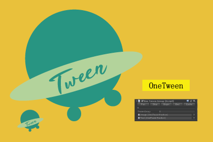

## 

[OneTween]( https://assetstore.unity.com/packages/slug/165223 
) 是一个更方便高效的Unity下的UGUI动画插件。特点是所见即所得。 

## 特点

OneTween 有很多突破性的功能，便于使用。包含以下特点： 

- 所见即所得: 编辑器下面就可以预览UGUI动画。 
- 支持常见的UGUI动画：Position, Scale, Rotation, Alpha 等。
- 方便调试：编辑器下支持逐帧预览动画。 
- 设置简单，支持拖拽和复制动画组件。
- 支持设置动画回调函数功能。
- 包含完整的代码和示例场景。

## 安装

在 “Assets/OneTween” 文件夹里面包含了所有的 OneTween 代码. 你可以把 OneTween 文件夹放在 Assets 文件夹下面的任意位置。

## 文档

[PDF](./Doc/README.pdf)

## Release 版本

### 1.0.1

Init release 

## 联系

更多信息可以进入网站:   https://assetstore.unity.com/packages/slug/165223 

Email: [936496193@qq.com](mailto:936496193@qq.com)
